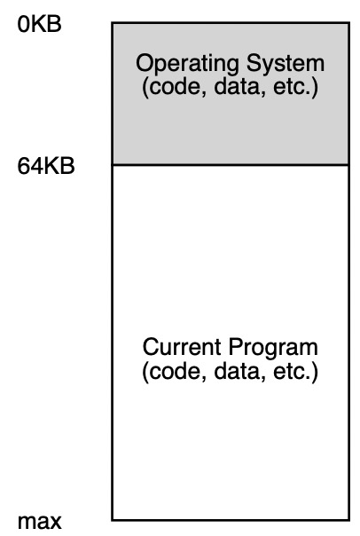
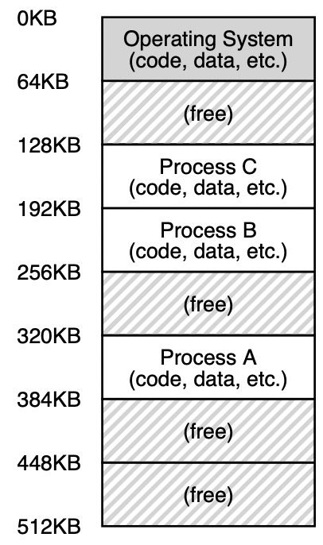
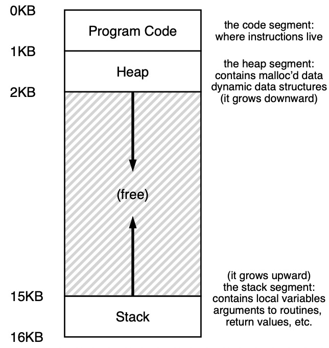

Virtual Memory Introduction
----

## 发展历程

1. 早起 操作系统就是一组函数在内存中

2. 随后分时共享系统出现，让每个进程单独占用全部内存运行一段时间，然后停止它，并将所有状态信息如寄存器和内存都保存到磁盘上
3. 由于保存和恢复内存太慢了，让每个进程独享一段内存

4. 由于隔离和保护的需求，对物理内存进行了抽象，这个抽象称之为地址空间(address space)

## 虚拟化内存(virtualizing memory)的目标

- 透明transparency: 程序感知不到内存被虚拟化了
- 效率efficiency: 时间和空间上没有过多额外开销
- 保护protection: 确保不同进程之间不会相互干扰