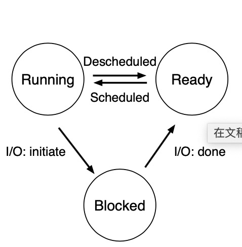

Abstraction: Processed
---

## 4.1 抽象：进程

进程(process): 正在运行的的程序的抽象

进程的机器状态(machine state):
    - 内存
    - 寄存器
    
## 4.2 进程API 

## 4.3 进程创建

1. 加载代码和所有静态数据(例如初始化变量)到内存中
2. 为运行时栈(runtime stack)分配内存， 可能为堆(heap)分配内存
3. 其他初始化，如创建标准输入、输出和错误输出
4. 运行main()函数，OS将CPU的控制权讲给新的进程

## 4.4 进程状态

简而言之有三种状态：running, ready, blocked

## 4.5 数据结构
